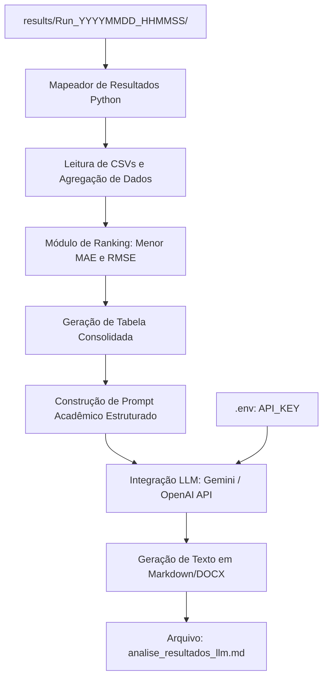

# ESN & GA - Automação de Simulações (PETR4)

Este projeto implementa uma automação completa para a execução sequencial em lote (batch) de simulações da rede neural **Echo State Network (ESN)** otimizada via **Algoritmo Genético (GA)** para prever os preços de fechamento diários das ações da PETR4 (Petrobras) entre 2000 e 2020. 

A arquitetura foi desenhada para garantir a reprodutibilidade dos testes do TCC, organizando os resultados de forma limpa, estruturada e livre de poluição de arquivos temporários.

---

## 📁 Arquitetura do Workspace

O projeto está organizado na seguinte estrutura de pastas:

```
d:\MAYCON\PROJETOS\ESNAUTO\
├── automate_simulations.py        # Centraliza o orquestrador em Python
├── run_simulations.bat            # Atalho interativo para rodar a automação no Windows
├── README.md                      # Instruções do projeto (este arquivo)
│
├── reports/                       # Centraliza os relatórios do TCC
│   ├── Relatorio_Automacao_ESN.md
│   ├── Relatorio_Automacao_ESN.docx
│   └── MayconGarciaSilva_monografia.docx
│
└── Scripts/                       # Scripts e dados de simulação
    ├── acoes_petr4_esn.R          # Script R parametrizado e otimizado
    │
    ├── data/                      # Dados de entrada (imutáveis)
    │   ├── PETR4_close com factor_2000-2020.txt
    │   └── PETR4_close com factor_2000-2020_com data.csv
    │
    └── results/                   # Resultados estruturados
        │
        ├── archive/               # HISTÓRICO: Resultados e zips antigos
        │
        └── Run_YYYYMMDD_HHMMSS_{Mode}/ # Nova execução de simulação
            ├── pdfs/              # Cópia direta dos PDFs da execução (fácil comparação visual)
            ├── zips/              # Arquivos ZIP prontos para envio ao orientador
            └── scenarios/         # Pastas brutas de cada cenário com seus respectivos CSVs e logs
                ├── AlgGen PETR4 ESN_mae_otim40x60 com factor 10000_1 (...) Win Normal e W Normal/
                └── ...
```

---

## ⚙️ Pré-requisitos

### 1. R e Pacotes
Certifique-se de que o **R** (versão 4.0 ou superior) está instalado e os seguintes pacotes R estão disponíveis no ambiente de execução:
```R
install.packages(c("ggplot2", "PerformanceAnalytics", "GA", "pracma", "fitdistrplus", "MASS", "PearsonDS", "fGarch"))
# Nota: O pacote 'StockDistFit' deve ser instalado manualmente ou via repositório apropriado se aplicável.
```

### 2. Python 3
Necessário para rodar o orquestrador `automate_simulations.py`. Nenhuma biblioteca de terceiros é necessária (utiliza apenas a biblioteca padrão do Python).

---

## 🚀 Como Executar

Você pode iniciar as simulações de duas maneiras:

### Método 1: Pelo Atalho Batch (Recomendado no Windows)
1. Dê dois cliques no arquivo [run_simulations.bat](file:///d:/MAYCON/PROJETOS/ESNAUTO/run_simulations.bat).
2. No menu interativo que aparecer no prompt de comando:
   * Digite **`1`** para executar o **Modo Teste** (execução rápida de 200 gerações em todos os cenários para validar o fluxo).
   * Digite **`2`** para executar o **Modo de Produção** (execução real de 10.000 gerações para o TCC).
   * Digite **`3`** para cancelar e sair.

### Método 2: Pelo Terminal de Comando (PowerShell / Command Prompt)
Navegue até a raiz do projeto e execute os comandos conforme sua necessidade:

* **Modo Teste Rápido** (200 gerações, rodadas 1, 2 e 3 sequencialmente):
  ```bash
  python automate_simulations.py --test
  ```

* **Modo Produção Oficial** (10.000 gerações, rodadas 1, 2 e 3 sequencialmente):
  ```bash
  python automate_simulations.py
  ```

* **Rodar Apenas uma Rodada Específica** (exemplo: rodada 2 em produção):
  ```bash
  python automate_simulations.py --run 2
  ```

* **Customizar o Número de Gerações do GA**:
  ```bash
  python automate_simulations.py --itera 5000
  ```

---

## 📊 Cenários Executados por Rodada

A automação executará sequencialmente as seguintes combinações de distribuição de pesos para as matrizes $W_{in}$ e $W$:
1. **Win Normal** e **W Normal**
2. **Win Uniforme** e **W Uniforme**
3. **Win GED** e **W Uniforme**
4. **Win GED** e **W Normal**

---

## 🛡️ Características da Arquitetura de Execução

* **Isolação de Resultados**: Cada execução cria uma pasta com carimbo de data/hora (`Run_YYYYMMDD_HHMMSS`), evitando a mistura de arquivos de rodadas diferentes.
* **Salvamento Nativo**: O script R grava os CSVs e o PDF diretamente na pasta do cenário de destino final (evitando arquivos temporários soltos na pasta `Scripts/`).
* **Visualização Ágil**: A pasta consolidada `pdfs/` armazena cópias de todos os PDFs gerados naquela sessão, permitindo comparar o histórico de fitness e o ajuste dos dados lado a lado de forma prática.
* **Compactação Automática**: Arquivos ZIP são gerados nativamente em `zips/` prontos para compartilhamento e envio por e-mail ou nuvem para o seu orientador.

---

## 🔮 Projetos Futuros

### Automação de Análise de Resultados via LLM

Consiste no desenvolvimento de um script Python integrável (`analyze_results.py`) que consome APIs de modelos de linguagem (ex: Gemini API ou OpenAI API) para analisar de forma estatística e qualitativa as simulações executadas, gerando automaticamente a redação para a seção de **Resultados e Discussões** do TCC.

#### ⚙️ Arquitetura de Análise e Funcionamento:



1. **Extração e Consolidação (Mapeamento)**:
   * O orquestrador varre os diretórios de cenários na pasta da sessão.
   * Lê os arquivos de dados gerados (ex: `Dados PETR4 ESN_mae_otim40x60...csv` e `Dados PETR4 resumo fitness...csv`).
   * Extrai métricas cruciais de cada um dos 12 testes: erro médio absoluto (**MAE**) de treino/validação, erro quadrático médio (**RMSE**), melhor fitness e hiperparâmetros finais otimizados pelo GA (como raio espectral $sr$, taxa de vazão $a$ e regularização $reg$).

2. **Filtro dos Melhores Modelos (Ranking)**:
   * O algoritmo ordena e ranqueia as distribuições de pesos ($W_{in}$ e $W$ nas variações Normal, Uniforme e GED) com base no desempenho na validação de 25% da série temporal.
   * Destaca automaticamente a configuração que obteve o menor erro.

3. **Geração do Prompt Acadêmico**:
   * O script monta um prompt parametrizado contendo:
     * O contexto do TCC (Previsão de PETR4 usando ESN otimizada com GA).
     * A tabela consolidada dos 12 cenários em formato Markdown.
     * Diretrizes de redação acadêmica (análise da influência de cada distribuição na capacidade de memória da rede e convergência do GA).
   * O prompt é enviado via chamada de API (autenticada de forma segura por chave carregada de arquivo `.env`).

4. **Resultado Final**:
   * O modelo de linguagem gera uma análise comparativa profunda detalhando como a distribuição GED (Generalized Error Distribution) ou Uniforme impactou a representação do espaço de estados no reservatório.
   * O texto gerado é salvo em `reports/analise_resultados_llm.md` e convertido diretamente para Word, pronto para ser revisado e incorporado à sua monografia.
