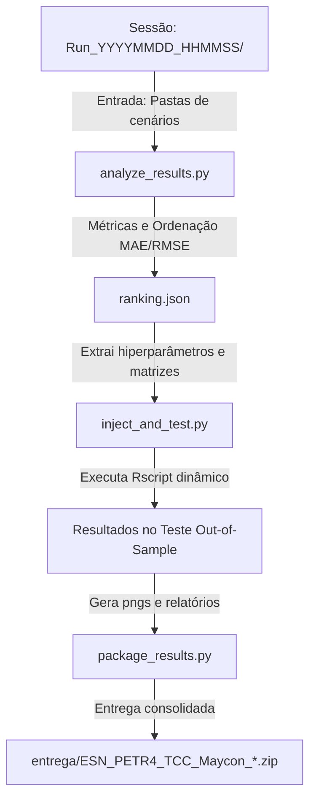

# 🛠️ Componente 2: Pipeline de Pós-Processamento, Ranqueamento e Teste

Este componente é responsável pelo **pós-processamento dos resultados brutos** gerados na Fase 1. Ele analisa os dados de todas as simulações, identifica estatisticamente o melhor modelo com base na partição de validação, extrai suas matrizes numéricas exatas, avalia o desempenho na partição final **Out-of-Sample de Teste (25%)** e gera o pacote de entrega consolidado.

---

## 📂 Arquivos Integrantes do Componente

```
ESNAUTO/
├── Scripts/
│   ├── analyze_results.py          # Fase 2: Análise de CSVs e geração do ranking.json
│   ├── inject_and_test.py          # Fase 3: Extração de matrizes e teste out-of-sample
│   └── package_results.py          # Fase 4: Consolidação e geração do ZIP de entrega
├── scratch_best.py                 # Utilitário de busca rápida do melhor cenário
├── scratch_mark.py                 # Utilitário de formatação e tags
├── scratch_matrices.py             # Utilitário de inspeção e teste de matrizes
└── scratch_verify.py               # Utilitário de verificação de integridade
```

---

## 🔄 Diagrama do Pipeline em 4 Fases



---

## 📝 Detalhamento de Cada Arquivo

### 1. `Scripts/analyze_results.py` (Fase 2)
- **Caminho**: [`Scripts/analyze_results.py`](../Scripts/analyze_results.py)
- **Linguagem**: Python 3
- **Função**: Varre os arquivos de log (`Dados PETR4 resumo fitness...csv`) e de resultados de cada um dos 12 cenários dentro da pasta da sessão informada.

#### 🔑 Principais Funcionalidades:
- **Parse de Fitness**: Extrai o melhor fitness alcançado pelo GA e os hiperparâmetros correspondentes ($a$, $sr$, $initLen$, $tam\_reservoir$, $reg$).
- **Cálculo de MAE e RMSE**: Lê as séries temporais de predição vs. real na partição de validação e calcula os erros absolutos e quadráticos médios.
- **Geração do `ranking.json`**: Constrói um arquivo JSON ordenado do melhor para o pior cenário com base no erro de validação.

#### 💻 Uso:
```bash
python Scripts/analyze_results.py Scripts/results/Run_YYYYMMDD_HHMMSS_Mode
```

---

### 2. `Scripts/inject_and_test.py` (Fase 3)
- **Caminho**: [`Scripts/inject_and_test.py`](../Scripts/inject_and_test.py)
- **Linguagem**: Python 3 (gerando script R temporário via `subprocess`)
- **Função**: Garante a avaliação imune a *data leakage*. Lê o `ranking.json`, processa todos os cenários e recupera suas matrizes de pesos $W_{in}$ e $W$.

#### 🔑 Principais Funcionalidades:
- **Extração de Matrizes**: Localiza os arquivos de matrizes e parâmetros dos cenários.
- **Script R Temporário Dinâmico**: Gera e executa um script R temporário que injeta diretamente essas matrizes numéricas no modelo ESN.
- **Avaliação de Teste (25%)**: Roda a predição na partição cega de teste (anos 2015-2020) e calcula os erros MAE, RMSE, MAPE e R² finais.
- **Saídas**: Salva os relatórios `resultados_validacao_teste.txt`, `resultados_validacao_teste.md` e os gráficos `grafico_validacao.png` e `grafico_teste.png`.

#### 💻 Uso:
```bash
python Scripts/inject_and_test.py Scripts/results/Run_YYYYMMDD_HHMMSS_Mode
```

---

### 3. `Scripts/package_results.py` (Fase 4)
- **Caminho**: [`Scripts/package_results.py`](../Scripts/package_results.py)
- **Linguagem**: Python 3
- **Função**: Módulo de empacotamento final de entrega para o orientador.

#### 🔑 Principais Funcionalidades:
- **Validação de Arquivos Obrigatórios**: Confirma que os relatórios e gráficos foram gerados sem erros.
- **Diretório `entrega/`**: Copia todos os artefatos finais, JSONs e ZIPs individuais para a pasta `entrega/`.
- **Empacotamento ZIP**: Cria um arquivo `.zip` final consolidado contendo todos os relatórios e figuras para envio imediato.

#### 💻 Uso:
```bash
python Scripts/package_results.py Scripts/results/Run_YYYYMMDD_HHMMSS_Mode
```

---

### 4. Scripts Auxiliares de Rascunho / Scratch (`scratch_*.py`)

- **[`scratch_best.py`](../scratch_best.py)**: Script Python para rápida varredura e impressão no terminal dos melhores hiperparâmetros encontrados em uma pasta de simulação sem rodar o pipeline completo.
- **[`scratch_mark.py`](../scratch_mark.py)**: Script de marcação e inclusão de anotações e tags nos relatórios brutos de resultado.
- **[`scratch_matrices.py`](../scratch_matrices.py)**: Utilitário para validar as dimensões, o raio espectral real e as propriedades estatísticas das matrizes $W_{in}$ e $W$ gravadas durante a simulação em R.
- **[`scratch_verify.py`](../scratch_verify.py)**: Script de verificação de integridade dos arquivos CSV para detectar possíveis linhas truncadas ou simulações interrompidas.
