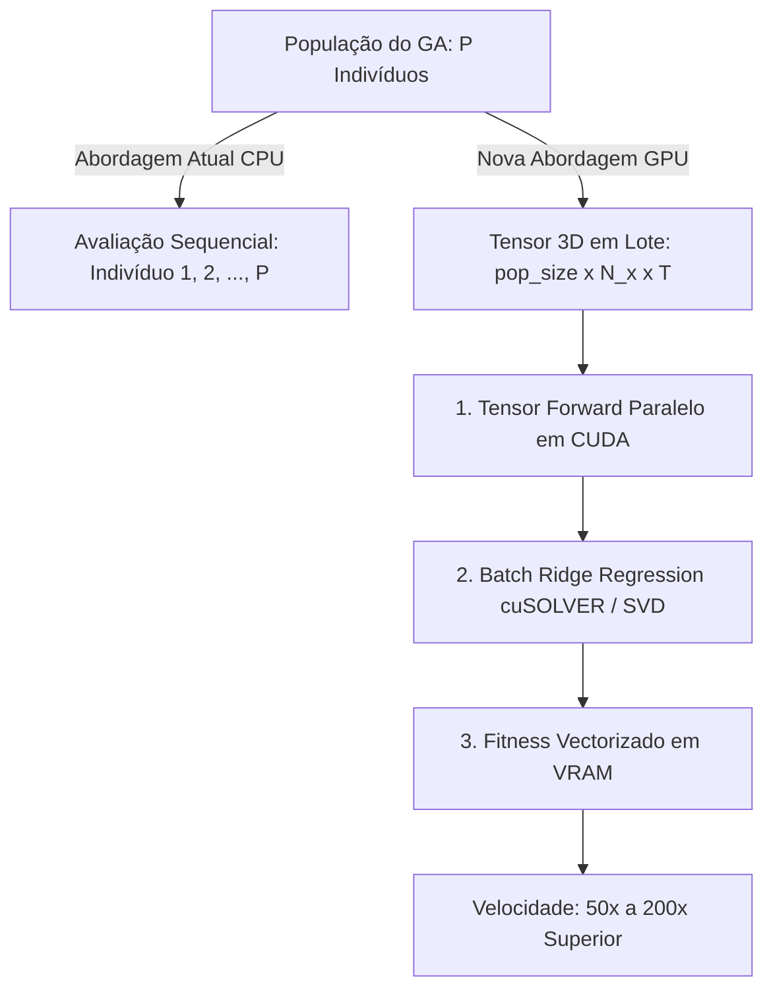

# 🚀 Guia Técnico de Extensão: Aceleração em GPU Dedicada (NVIDIA CUDA / OpenCL)

> **Projeto:** ESNAUTO — Otimização de Echo State Networks com Algoritmo Genético e Deep Learning  
> **Autor da Arquitetura Base:** Maycon Garcia Silva  
> **Público-Alvo deste Documento:** Pesquisadores, orientandos e desenvolvedores responsáveis por implementar o módulo de aceleração em placa de vídeo dedicada (GPU).

---

## 🎯 1. Visão Geral e Propósito

Atualmente, o **ESNAUTO** realiza todas as operações matriciais da ESN e as mutações do Algoritmo Genético diretamente na **CPU** (com suporte a múltiplos núcleos), enquanto os modelos de Deep Learning (LSTM e GRU via Keras 3/TensorFlow) já utilizam aceleração automática em GPU caso os drivers NVIDIA CUDA estejam presentes.

Este documento estabelece o **blueprint arquitetural**, os **pontos de injeção (*hooks*)** e os **modelos matemáticos** para que o novo pesquisador possa desenvolver o módulo de processamento massivo da ESN e do GA na **Placa de Vídeo Dedicada (GPU)**, multiplicando a velocidade de simulação em dezenas ou centenas de vezes ($50\times$ a $200\times$).

---

## ⚡ 2. Onde a GPU trará Maior Ganho (Gargalos Computacionais)

Na arquitetura da Echo State Network otimizada por Algoritmo Genético, existem **3 grandes oportunidades de paralelismo massivo em GPU**:



### Gargalo 1: Avaliação em Lote (*Batch Population Evaluation*) — O Maior Ganho!
* **Como a CPU faz hoje:** O GA testa os $P$ indivíduos (ex: $P = 10$ a $50$) um por um em um loop sequencial.
* **Como a GPU deve fazer:** Criar um **Tensor 3D** de estados de dimensões:
  $$\mathbf{X}_{\text{batch}} \in \mathbb{R}^{P \times (1 + \text{inSize} + N_x) \times T}$$
  Ao invés de rodar $P$ loops temporais, a GPU calcula a ativação $\tanh(W_{\text{in}} u_t + W x_t)$ para **todos os $P$ indivíduos simultaneamente** em milhares de núcleos CUDA com uma única instrução matricial por passo de tempo.

### Gargalo 2: Resolução da Regressão Ridge ($W_{\text{out}}$)
* O cálculo da camada de saída requer resolver:
  $$W_{\text{out}} = Y_{\text{target}} X^T (X X^T + \lambda I)^{-1}$$
* Na GPU, a inversão ou resolução do sistema linear $(X X^T + \lambda I)$ pode ser calculada via decomposição de Cholesky acelerada por GPU (`cuSOLVER` ou `torch.linalg.solve`).

---

## 📂 3. Arquitetura de Módulos e Pontos de Injeção no Código

O projeto já possui uma camada de abstração de hardware pronta em:
👉 [`app/utils/hardware_config.R`](../app/utils/hardware_config.R)

### Principais Funções Disponíveis:
1. `detectar_hardware()`: Detecta CPU cores, dispositivos CUDA e GPUs NVIDIA instaladas.
2. `definir_dispositivo(tipo = "cpu" | "gpu_cuda" | "gpu_opencl")`: Define o dispositivo global ativo.
3. `obter_dispositivo_ativo()`: Retorna se a aplicação deve executar em CPU ou GPU.

### Pontos de Injeção (*Hooks*) Preparados para Implementação:

| Função Hook em `app/utils/hardware_config.R` | Responsabilidade a ser Desenvolvida |
| :--- | :--- |
| **`esn_forward_gpu_hook(Win, W, U, a, sr)`** | Propagar a série temporal $U$ pela matriz $W$ em GPU e retornar o tensor de estados $X$. |
| **`esn_ridge_gpu_hook(X, Yt, reg)`** | Resolver a regressão Ridge na GPU e retornar a matriz ótima $W_{\text{out}}$. |
| **`ga_fitness_batch_gpu_hook(pop_matrix, dados)`** | Avaliar toda a população do GA de forma massiva e vetorizada na VRAM. |

---

## 🛠️ 4. Tecnologias Recomendadas para o Desenvolvedor da GPU

O pesquisador responsável pode escolher entre duas rotas principais de desenvolvimento:

### Rota A (Recomendada): Pacote `torch` para R (LibTorch C++ Direto)
Permite usar tensores e CUDA diretamente em R sem depender de Python:
```r
# Exemplo de implementação em R com torch:
library(torch)

# 1. Enviar matrizes para a VRAM da GPU
d_Win <- torch_tensor(Win, device = "cuda", dtype = torch_float32())
d_W   <- torch_tensor(W_scaled, device = "cuda", dtype = torch_float32())
d_U   <- torch_tensor(U, device = "cuda", dtype = torch_float32())

# 2. Operações tensoriais vetorizadas em GPU
# x = (1 - a) * x + a * torch_tanh(torch_matmul(d_Win, u) + torch_matmul(d_W, x))
```

### Rota B: Módulo Python em PyTorch / CuPy via `reticulate`
Caso o pesquisador prefira programar em Python com PyTorch:
```python
import torch

device = torch.device("cuda" if torch.cuda.is_available() else "cpu")

def forward_batch_esn(Win_batch, W_batch, U, a_batch, sr_batch):
    # Win_batch: [P, Nx, 2]
    # W_batch:   [P, Nx, Nx]
    # U:         [T]
    # Retorna X_batch: [P, 1 + 1 + Nx, T]
    pass
```

---

## 📊 5. Tabela Comparativa de Metas de Desempenho

| Métrica | Arquitetura Atual (CPU) | Meta com Aceleração em GPU (CUDA) |
| :--- | :---: | :---: |
| **10.000 Gerações do GA** | ~10 a 15 minutos | **~15 a 30 segundos** |
| **15.000 Gerações do GA** | ~20 a 25 minutos | **~30 a 45 segundos** |
| **População do GA** | $P = 10$ indivíduos | **$P = 50$ a $200$ indivíduos simultâneos** |
| **Tamanho do Reservatório ($N_x$)** | 3 a 50 neurônios | **100 a 1.000 neurônios** |

---

## 🤝 6. Suporte e Continuidade

Esta base foi estruturada para que o desenvolvimento do módulo de GPU ocorra de maneira **isolada e modular**, sem quebrar o funcionamento do modo CPU atual (que continuará como *fallback* automático).

Para dúvidas sobre a formulação matemática da ESN ou sobre o mapeamento genético de 55 bits, consulte os documentos:
- [`06_secao_artigo_tfc_otimizacao_ga.md`](06_secao_artigo_tfc_otimizacao_ga.md)
- [`03_app_shiny_studio.md`](03_app_shiny_studio.md)
