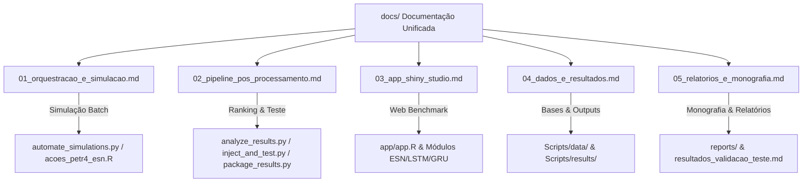

# 📚 Documentação Unificada do Projeto ESNAUTO

> **Trabalho de Conclusão de Curso (TCC) — Maycon Garcia Silva**  
> Previsão de Séries Temporais Financeiras (PETR4 2000–2020) com **Echo State Networks (ESN)** otimizadas por **Algoritmo Genético (GA)** e comparação com Deep Learning (**LSTM** / **GRU**).

Bem-vindo à documentação central do repositório **ESNAUTO**. Esta documentação está organizada de forma modular, com um documento dedicado a cada um dos **5 componentes principais da arquitetura**, explicando a função, os parâmetros e a utilidade de cada arquivo no projeto.

---

## 🗺️ Mapa da Documentação por Componente

---

## 📑 Lista dos Componentes

| # | Arquivo de Documentação | Descrição do Componente | Arquivos Abrangidos |
|---|---|---|---|
| 01 | [01_orquestracao_e_simulacao.md](file:///g:/Outros%20computadores/Meu%20computador/TFC1/ESNAUTO/docs/01_orquestracao_e_simulacao.md) | **Orquestração e Simulação Batch ESN+GA** | `automate_simulations.py`, `run_simulations.bat`, `Scripts/acoes_petr4_esn.R`, `Scripts/gerar_graficos_corrigidos.R` |
| 02 | [02_pipeline_pos_processamento.md](file:///g:/Outros%20computadores/Meu%20computador/TFC1/ESNAUTO/docs/02_pipeline_pos_processamento.md) | **Pipeline de Pós-Processamento e Teste** | `Scripts/analyze_results.py`, `Scripts/inject_and_test.py`, `Scripts/package_results.py`, `scratch_*.py` |
| 03 | [03_app_shiny_studio.md](file:///g:/Outros%20computadores/Meu%20computador/TFC1/ESNAUTO/docs/03_app_shiny_studio.md) | **ESNAUTO Benchmark Studio (R Shiny App)** | `app/app.R`, `app/modules/*`, `app/utils/*`, `app/www/custom.css` |
| 04 | [04_dados_e_resultados.md](file:///g:/Outros%20computadores/Meu%20computador/TFC1/ESNAUTO/docs/04_dados_e_resultados.md) | **Gestão de Dados e Estrutura de Resultados** | `Scripts/data/*`, `Scripts/results/`, `resultados_tcc/*` |
| 05 | [05_relatorios_e_monografia.md](file:///g:/Outros%20computadores/Meu%20computador/TFC1/ESNAUTO/docs/05_relatorios_e_monografia.md) | **Relatórios e Documentos Acadêmicos** | `reports/*`, `resultados_validacao_teste.md`, `resultados_validacao_teste2.md` |

---

## ⚡ Guia de Navegação Rápida

- **Para rodar simulações em lote**: Veja as instruções em [01_orquestracao_e_simulacao.md](file:///g:/Outros%20computadores/Meu%20computador/TFC1/ESNAUTO/docs/01_orquestracao_e_simulacao.md).
- **Para analisar resultados e gerar entrega**: Veja as instruções em [02_pipeline_pos_processamento.md](file:///g:/Outros%20computadores/Meu%20computador/TFC1/ESNAUTO/docs/02_pipeline_pos_processamento.md).
- **Para usar a aplicação Web interativa R Shiny**: Veja as instruções em [03_app_shiny_studio.md](file:///g:/Outros%20computadores/Meu%20computador/TFC1/ESNAUTO/docs/03_app_shiny_studio.md).
- **Para entender o formato das bases e métricas salvas**: Veja [04_dados_e_resultados.md](file:///g:/Outros%20computadores/Meu%20computador/TFC1/ESNAUTO/docs/04_dados_e_resultados.md).
- **Para consultar a monografia e relatórios de validação**: Veja [05_relatorios_e_monografia.md](file:///g:/Outros%20computadores/Meu%20computador/TFC1/ESNAUTO/docs/05_relatorios_e_monografia.md).
