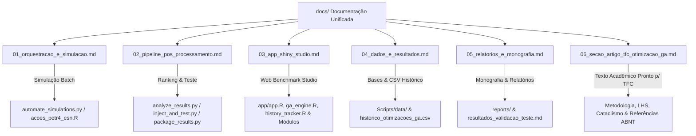

# 📚 Documentação Unificada do Projeto ESNAUTO

> **Trabalho de Conclusão de Curso (TCC) — Maycon Garcia Silva**  
> Previsão de Séries Temporais Financeiras (PETR4 2000–2020) com **Echo State Networks (ESN)** otimizadas por **Algoritmo Genético (GA com LHS e Cataclismo)** e comparação com Deep Learning Recorrente (**LSTM** / **GRU**).

Bem-vindo à documentação central do repositório **ESNAUTO**. Esta documentação está organizada de forma modular, com um documento dedicado a cada um dos **6 componentes e relatórios principais da arquitetura**:

---

## 🗺️ Mapa da Documentação por Componente

---

## 📑 Lista dos Componentes e Guias

| # | Arquivo de Documentação | Descrição do Componente | Arquivos Abrangidos |
|---|---|---|---|
| 01 | [`01_orquestracao_e_simulacao.md`](01_orquestracao_e_simulacao.md) | **Orquestração e Simulação Batch ESN+GA** | `automate_simulations.py`, `run_simulations.bat`, `Scripts/acoes_petr4_esn.R`, `Scripts/gerar_graficos_corrigidos.R` |
| 02 | [`02_pipeline_pos_processamento.md`](02_pipeline_pos_processamento.md) | **Pipeline de Pós-Processamento e Teste** | `Scripts/analyze_results.py`, `Scripts/inject_and_test.py`, `Scripts/package_results.py`, `scratch_*.py` |
| 03 | [`03_app_shiny_studio.md`](03_app_shiny_studio.md) | **ESNAUTO Benchmark Studio (R Shiny App)** | `app/app.R`, `app/modules/*`, `app/utils/*` (`ga_engine.R`, `history_tracker.R`), `app/www/custom.css` |
| 04 | [`04_dados_e_resultados.md`](04_dados_e_resultados.md) | **Gestão de Dados e Estrutura de Resultados** | `Scripts/data/*`, `historico_otimizacoes_ga.csv`, `melhor_recorde_global/`, `resultados_tcc/*` |
| 05 | [`05_relatorios_e_monografia.md`](05_relatorios_e_monografia.md) | **Relatórios e Documentos Acadêmicos** | `reports/*`, `resultados_validacao_teste.md`, `resultados_validacao_teste2.md` |
| 06 | [`06_secao_artigo_tfc_otimizacao_ga.md`](06_secao_artigo_tfc_otimizacao_ga.md) | **Texto Completo Formatado para o Artigo do TFC** | *Metodologia formal do GA com LHS e Cataclismo, formulação matemática de 55 bits, busca profunda em 15.000+ gerações, tabelas de benchmark e referências ABNT* |

---

## ⚡ Guia de Navegação Rápida

- **Para redigir a metodologia e resultados do artigo do seu TFC**: Consulte diretamente [`06_secao_artigo_tfc_otimizacao_ga.md`](06_secao_artigo_tfc_otimizacao_ga.md).
- **Para rodar o app web interativo (R Shiny)**: Veja [`03_app_shiny_studio.md`](03_app_shiny_studio.md).
- **Para rodar simulações em lote**: Veja [`01_orquestracao_e_simulacao.md`](01_orquestracao_e_simulacao.md).
- **Para analisar resultados e gerar entrega**: Veja [`02_pipeline_pos_processamento.md`](02_pipeline_pos_processamento.md).
- **Para entender o formato das bases e CSVs de recordes salvos**: Veja [`04_dados_e_resultados.md`](04_dados_e_resultados.md).
