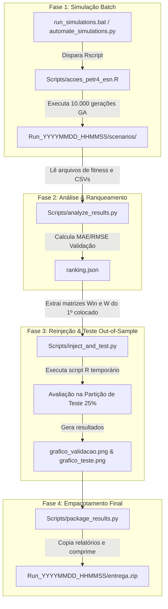

# 📑 Relatório Técnico: Arquitetura, Pipeline de Automação e Benchmark ESN/GA

Este relatório documenta a reestruturação física, a arquitetura modular e o pipeline automatizado de execução e validação da rede neural **Echo State Network (ESN)** otimizada com **Algoritmo Genético (GA)** para a previsão do preço de fechamento das ações **PETR4** (2000–2020).

---

## 📁 Arquitetura do Workspace

O projeto está fisicamente organizado por áreas de responsabilidade:

```
ESNAUTO/
├── README.md                            # Documentação principal
├── automate_simulations.py              # Orquestrador central em Python (Simulações Batch)
├── run_simulations.bat                  # Atalho interativo para execução no Windows
│
├── app/                                 # 🖥️ ESNAUTO Benchmark Studio (R Shiny App)
│   ├── app.R                            # Interface gráfica e servidor Shiny
│   ├── modules/                         # Módulos: mod_esn.R, mod_lstm.R, mod_gru.R, mod_comparacao.R
│   ├── utils/                           # Manipulação de dados (data_prep.R) e métricas (metrics.R)
│   └── www/                             # CSS customizado (custom.css)
│
├── reports/                             # 📄 Relatórios Acadêmicos e TCC
│   ├── Relatorio_Automacao_ESN.md       # Este relatório técnico de arquitetura
│   ├── Relatorio_Automacao_ESN.docx     # Versão em Word
│   └── MayconGarciaSilva_monografia.docx# Monografia do TCC
│
├── Scripts/                             # ⚙️ Scripts do Pipeline de Simulação
│   ├── acoes_petr4_esn.R                # Script R parametrizado de treino ESN + GA
│   ├── analyze_results.py               # Fase 2: Análise de CSVs e geração de ranking.json
│   ├── inject_and_test.py               # Fase 3: Extração de matrizes ótimas e teste out-of-sample
│   ├── package_results.py               # Fase 4: Consolidação dos resultados na pasta entrega/
│   ├── gerar_graficos_corrigidos.R      # Script R de gráficos estatísticos
│   │
│   ├── data/                            # Dados históricos de entrada (PETR4 2000-2020)
│   └── results/                         # Resultados estruturados por sessão
│       └── Run_YYYYMMDD_HHMMSS_{Mode}/  # Sessão gerada automaticamente
│           ├── pdfs/                    # PDFs compilados por cenário
│           ├── zips/                    # Pacotes compactados
│           └── scenarios/               # Dados brutos dos 12 cenários
│
└── resultados_tcc/                      # Gráficos e txt oficiais do TCC
```

---

## 🔄 Fluxo de Trabalho em 4 Fases (Pipeline End-to-End)



---

## 🛠️ Detalhamento dos Componentes do Pipeline

### 1. Script R Parametrizado (`Scripts/acoes_petr4_esn.R`)
* **Parâmetros via CLI**: Aceita 5 argumentos de linha de comando: `win_dist`, `w_dist`, `num_iter`, `run_id` e `output_dir`.
* **Isolação de Arquivos**: Registra CSVs (`Dados PETR4...csv`), matrizes ótimas (`matriz_Win_epoca_...txt`, `matriz_W_epoca_...txt`) e o documento PDF diretamente na pasta do cenário correspondente.
* **Salvamento de PDF Nátivo**: Fecha corretamente o dispositivo gráfico através de `dev.off()`, salvando a evolução de fitness do GA e os histogramas iniciais em uma página unificada.

### 2. Análise e Ranqueamento (`Scripts/analyze_results.py`)
* Varre todas as pastas de cenários da sessão.
* Analisa as últimas épocas salvas dos arquivos de fitness.
* Ordena os cenários em ordem crescente de erro (MAE/RMSE na partição de validação).
* Exporta o arquivo estruturado `ranking.json` contendo o ranking completo com hiperparâmetros e sementes aleatórias.

### 3. Extração e Teste Out-of-Sample (`Scripts/inject_and_test.py`)
* Consome o `ranking.json` para selecionar o melhor cenário de reservatório.
* Extrai do arquivo de log as matrizes numéricas exatas de $W_{in}$ e $W$ da melhor época.
* Constrói e roda um script R dinâmico que carrega as matrizes e realiza a predição na partição final de **Teste (25%)**, imune a *data leakage*.

### 4. Empacotamento de Resultados (`Scripts/package_results.py`)
* Valida a integridade dos arquivos gerados (`resultados_validacao_teste.txt`, `grafico_validacao.png`, `grafico_teste.png`).
* Cria o diretório `entrega/` dentro da sessão e gera um arquivo `.zip` final consolidado para envio ao orientador.

---

## 🖥️ ESNAUTO Benchmark Studio (R Shiny)

Além do pipeline batch de simulações, o projeto conta com uma aplicação web interativa em **R Shiny** localizada em `app/`:

- **Aba Dados PETR4**: Carregamento da série histórica, visualização da curva e configuração dinâmica dos pontos de corte de treino (50%), validação (25%) e teste (25%).
- **Aba ESN (Reservoir)**: Ajuste fino visual dos hiperparâmetros da ESN ($a$, $sr$, $initLen$, $tam\_reservoir$, $reg$) com feedback imediato de gráficos de ajuste e resíduos.
- **Abas LSTM e GRU**: Modelagem de redes recorrentes profundas para benchmark direto.
- **Aba Comparativa**: Tabela unificada comparando ESN vs. LSTM vs. GRU com métricas $R^2$, MAE, RMSE e MAPE.

---

## 🚀 Como Rodar o Pipeline Completo

Para executar a automação completa a partir da raiz do projeto:

```bash
# 1. Executar as simulações batch do GA (10.000 gerações)
python automate_simulations.py

# 2. Executar análise e empacotamento da última sessão gerada
python Scripts/analyze_results.py Scripts/results/<NOME_DA_SESSAO>
python Scripts/inject_and_test.py Scripts/results/<NOME_DA_SESSAO>
python Scripts/package_results.py Scripts/results/<NOME_DA_SESSAO>
```

